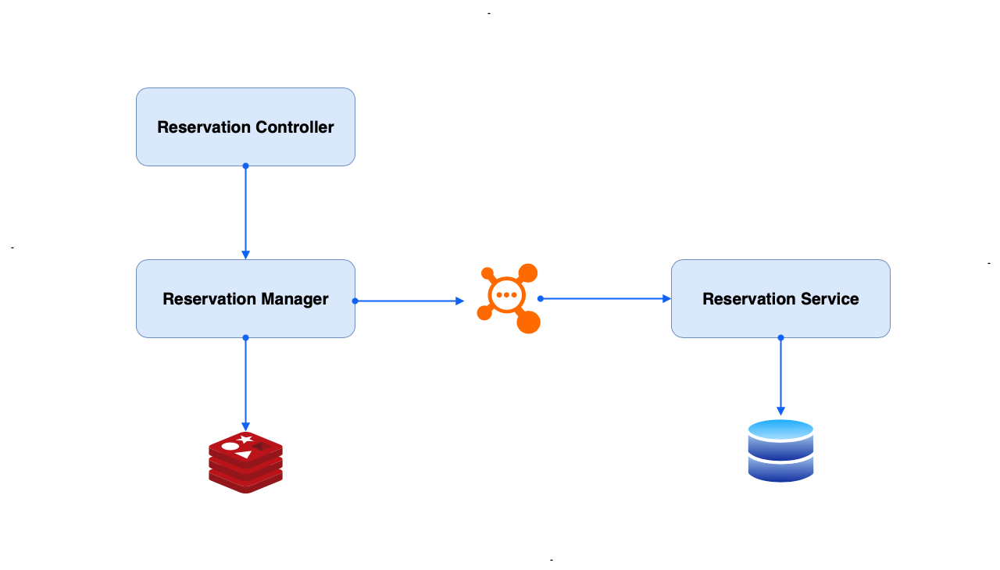
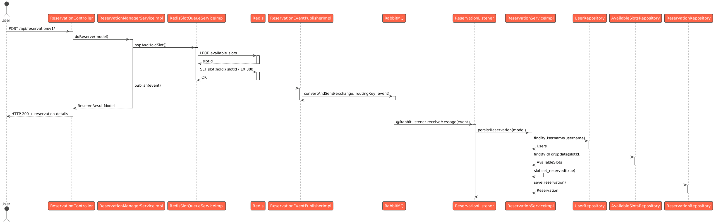

# ⚡ Snap Reserve

SnapReserve is a high-performance reservation system designed to handle massive concurrency without locks! It guarantees
users can book the nearest available slot in under 100ms, even under extreme load.

Unlike traditional solutions that rely on database locks or distributed locks (which create bottlenecks), SnapReserve
uses a distributed queue and events to eliminate race conditions at the source! This makes it incredibly fast, scalable,
and race-condition-free.

# 🔄 How It Works

1. **Periodic Synchronization** : Every 5 minutes, the system fetches available time slots from database and syncs them
   to a Redis sorted queue, ordered by time. 
2. **Atomic Slot Allocation** : When a user requests a reservation, Redis atomically pops the nearest available time
   slot using a single-threaded, atomic operation that prevents race conditions; High performance O(1) list operations.
3. **Temporary Hold** : The popped slot is immediately placed on a temporary hold with TTL (time-to-live) to prevent it
   from being re-added to the available queue during sync lag periods, ensuring the slot remains reserved for the
   current user.
4. **Event Publishing** : The reservation details are published to a durable RabbitMQ queue for asynchronous processing.
5. **Immediate Response** : User receives reservation confirmation immediately without waiting for database persistence.
6. **Background Persistence** : RabbitMQ listener consumes the event and persists the reservation to database in a
   transactional manner.

**The system uses multiple layers of concurrency control:**

* Redis Atomic Operations: Single-threaded Redis ensures atomic LPOP + SET operations with O(1) Time complexity!
* Database Constraints: Unique constraints prevent duplicate reservations
* Transaction Management: ACID transactions ensure data consistency




## 🧪 Integration Testing with Testcontainers
To guarantee our application works correctly with the actual infrastructure, our integration tests use Testcontainers. This spins up real Redis and RabbitMQ instances in Docker containers for a authentic testing environment.

What we test:
* Services & Controllers: End-to-end workflow tests, from API request to message publication.
* Redis Interactions: Verifying the atomic operation correctly reserves and returns the nearest time slot.
* RabbitMQ Messaging: Ensuring events are correctly published to the right queues and are durable.

## 🚀 Features & Technical Highlights

* 🧵 **Modern Java & Virtual Threads**: Built on Java 21, the application leverages Virtual Threads to handle massive concurrency efficiently. This prevents I/O blocking from wasting precious platform threads, allowing the system to handle a high number of concurrent requests with minimal resource overhead.
* ☁️ **API Gateway & Load Balancer**: The system is designed to be deployed behind an API Gateway (Spring Cloud Gateway) to efficiently route and distribute traffic across multiple application instances.
* 🔒 **Scheduler Coordination**: The pre-loading scheduler is distributed-system-aware. It uses ShedLock to ensure that only one instance of the scheduler runs across multiple application instances, preventing duplicate time slices from being synced to Redis.
* 🔄 **Pluggable Messaging**: The eventing system is designed for flexibility. While the current implementation uses RabbitMQ for its robust features and durability, it can be seamlessly swapped for Kafka in environments requiring extremely high throughput and log-based event streaming.
* ⚙️ **Security Profiles**: Security is profile-based. The local profile runs with Spring Security disabled for ease of development. To enable authentication and authorization, simply run the application with a different profile (e.g., prod).
* ⏭️ **Future Considerations**:
  * Circuit Breaker: A circuit breaker pattern (e.g., using Resilience4j) is a planned enhancement to improve system resiliency against failures in downstream dependencies like Redis or RabbitMQ.
  * Monitoring: Integration with monitoring tools (Prometheus, Grafana) for observability would be a valuable addition.

# 📄 Access Documentation
Swagger UI
```
 http://localhost:8080/swagger-ui.html
```


# 🧑‍💻 Pre-requisites

Start the docker

```
   docker compose up
```
